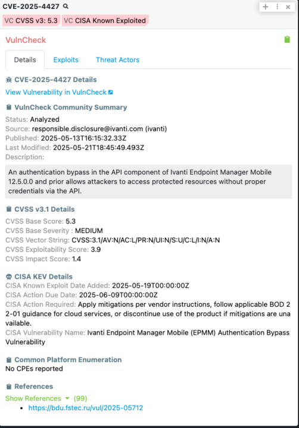
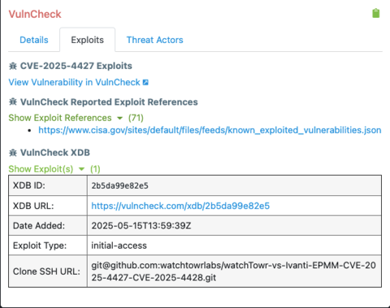
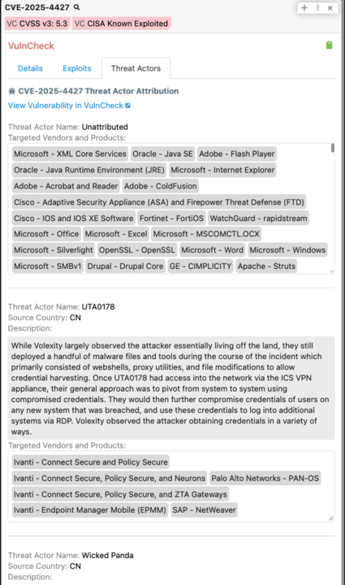

# Polarity VulnCheck Integration
The Polarity - VulnCheck integration searches CVEs in VulnCheck for CVE details, Exploit Data, and Threat Actor Attribution on your screen.  The details are then displayed via the Polarity Overlay Window, and we support the VulnCheck Community API out of the box if you do not already have a Premium API Key.

Sign up for a free VulnCheck Community API key here https://www.vulncheck.com/community

|  || | 
|---|---|---|
|*CVE* |*VulnCheck XDB Result*|*Threat Actor Attribution*|

To learn more about VulnCheck, please visit the [official website](https://vulncheck.com).

## VulnCheck Integration Options

### VulnCheck API URL
The base URL to the GreyNoise API you wish to use. Defaults to `https://api.vulncheck.com/`.

### API Key
Account API key used to access VulnCheck API.

### Search using the Premium API

If checked, the integration will search using the VulnCheck Subscription Based APIs. When unchecked, the VulnCheck Community API will be used

## Installation Instructions

Installation instructions for integrations are provided on the [PolarityIO GitHub Page](https://polarityio.github.io/).

## Polarity

Polarity is a memory-augmentation platform that improves and accelerates analyst decision making.  For more information about the Polarity platform please see:

https://polarity.io/
